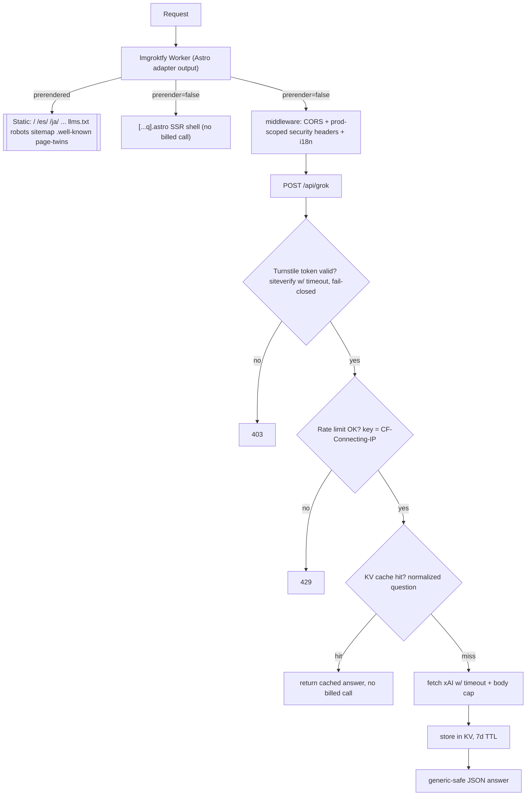

# feat: Migrate lmgroktfy to Astro 7.1.4 + Cloudflare adapter

## Summary

Rewrite the lmgroktfy site from its vanilla-TS client-rendered SPA into an Astro 7.1.4 app on Cloudflare Workers using
the `@astrojs/cloudflare` adapter (hybrid rendering: static pages prerendered, `/api/*` and the pretty-URL shell SSR).
Retain every current feature (6-locale i18n, keyboard shortcuts, `aria-live` accessibility, the mandatory
`/your+question` question-in-URL feature, share links, theme, placeholder animation), move i18n to Astro's URL routing,
add an agent-native surface (markdown twins, `llms.txt`, `.well-known`), bump Cloudflare Workers to a current
`compatibility_date` + wrangler 4.x, add a `lmgroktfy-staging` workers.dev deploy verified before the production cut,
**close the currently-open API** with Cloudflare Turnstile plus comprehensive server-side hardening, and add a ~1-week
KV answer cache so repeated/viral questions cost one billed xAI call per week.

## Problem Frame

lmgroktfy works but sits on three liabilities:

1. **The API is effectively open.** `POST /api/grok` proxies a **paid xAI key**. The only server-side controls are
   header-based origin/referer/zone checks (`packages/web/src/middleware/security.ts`) and an IP rate limit whose key
   falls back to the spoofable `X-Forwarded-For`/`'unknown'`. Header checks are trivially bypassed by any non-browser
   client, so in practice the endpoint is reachable by anyone; the real backstop is the xAI spend cap. `grok.ts` also
   leaks upstream and exception text to callers, reads an unbounded request body, and has no upstream timeout.
2. **The frontend is a hand-rolled SPA** (`packages/client`, bundled by `Bun.build`) with a bespoke Worker router
   (`packages/web`) reimplementing routing, CORS, security, and SPA fallback. It has no SEO/per-locale URLs and no
   agent-readable surface.
3. **A pre-existing typecheck failure** (`packages/client/tsconfig.json` maps `@lmgroktfy/shared` to `../shared/dist`,
   which `tsc --noEmit` never builds). The rewrite deletes `packages/client`, retiring this debt.

Cloudflare reality (verified against the account, 2026-07-28): exactly one `lmgroktfy` Worker exists (bindings
`API_KEY`, `ASSETS`, `ENVIRONMENT`, `RATE_LIMITER`) — there is no separate API worker, and it holds `lmgroktfy.com`/
`www` as exclusive `custom_domain` routes. The fleet uses account-level `<name>-staging` Workers (`meum-api-staging`,
`agentnative-site-staging`); note the meum-sites repo itself uses `-dev` naming and static Astro + a hand-written Worker
(no `@astrojs/cloudflare` adapter, no server-side Turnstile).

## Scope Boundaries

**In scope**

- Full rewrite to Astro 7.1.4 with `@astrojs/cloudflare` (hybrid rendering), single Worker.
- Feature parity: keyboard shortcuts, `aria-live` a11y, RTL, share links, theme, placeholder animation, and the
  **mandatory** `/your+question` question-in-URL feature (auto-submit on load).
- i18n via Astro URL routing (`ar de en es fr ja`, `en` unprefixed), RTL server-side, `?lang=` redirect shim.
- Agent-native surface: `llms.txt`, `robots.txt`, `sitemap.xml`, markdown twins of static pages, `/.well-known/`
  (`security.txt` + an agents/MCP descriptor).
- Cloudflare bump: current `compatibility_date`, wrangler 4.x, `nodejs_compat`.
- `lmgroktfy-staging` (workers.dev) deploy + verification before the production cut; explicit rollback runbook.
- API hardening: **Turnstile** (primary control) + body-size cap, upstream timeout, no error leakage, tightened
  question-length bound, CF-trusted rate-limit key, tightened CORS, prod-scoped security response headers.
- **~1-week KV answer cache** keyed by normalized question, so repeated/viral questions bound xAI spend and latency.

### Deferred to Follow-Up Work

- **SSR-rendered shared answers.** The KV answer cache (U7) is the persistence layer that makes rendering a shared
  answer server-side (on a cache **hit**, without a billed call) feasible. v1 keeps shared answers client-rendered; SSR
  from cache is a later enhancement.
- **Splitting `/api/grok` into its own Worker** — permitted, not required (KTD-5); a later blast-radius reduction.
- **Self-hosting FontAwesome** to drop the render-blocking CDN link.
- **Biome 1.9 → 2.x** alignment with meum-sites.

### Out of Scope

- Changing the core product — it stays a Grok proxy UI.
- Cloudflare WAF custom rules / bot-management dashboard config (Turnstile + the `RATE_LIMITER` binding cover v1;
  dashboard WAF is an ops task, not a code change).

## Key Technical Decisions

- **KTD-1 — `@astrojs/cloudflare` adapter with hybrid rendering** *(session-settled: user-directed — chosen over static
  Astro + hand-written Worker)*. One `astro build` emits the Worker; static pages prerender, `/api/*` and the pretty-URL
  shell are SSR (`export const prerender = false`). Rationale: uniform typed endpoints for the whole surface, colocated
  hardening/middleware, and Cloudflare is now first-party for Astro. No in-fleet adapter precedent exists (meum-sites is
  static + hand-Worker), so scaffold from Cloudflare's "Workers with static assets" adapter docs.
- **KTD-2 — Astro URL-routed i18n** *(session-settled: user-directed — over runtime client-side `data-i18n`)*.
  Per-locale SSG, zero i18n JS, real `hreflang`, RTL server-side; `?lang=` kept as a redirect shim.
- **KTD-3 — Full agent-native surface (describe-not-expose)** *(session-settled: user-directed)*. Markdown twins +
  `llms.txt` + `.well-known` (`security.txt` + a capability descriptor) + `robots`/`sitemap`. The surface advertises
  content and the site's purpose but publishes **no** callable `/api/grok` endpoint or invocation schema — a documented
  paid endpoint invites scanner/bot abuse regardless of any Turnstile caveat.
- **KTD-4 — Turnstile + comprehensive server-side hardening** *(session-settled: user-directed — over
  server-side-only)*. Turnstile is the load-bearing control that closes the open API; the endpoint fails closed without
  a valid token, and `siteverify` itself fails closed on timeout/error. No in-fleet server-side Turnstile precedent
  (meum-sites only bakes the public site key at build), so build `siteverify` from Cloudflare's Turnstile server-side
  docs.
- **KTD-5 — Single adapter Worker** *(session-settled: user-directed — splitting the API is optional)*.
- **KTD-6 — Shared answers stay client-rendered behind a Turnstile-gated `POST` in v1, and spend protection rests on
  Turnstile + rate-limit + the KV cache — not on the GET/POST distinction** *(session-settled: user-directed)*. The
  question-in-URL feature is mandatory and keeps auto-submitting; because a JS crawler can turn an advertised pretty-URL
  GET into a billed POST, spend is bounded by Turnstile + the CF-trusted rate limit + the answer cache, not by "no
  billed GET."
- **KTD-7 — Astro pinned to 7.1.4** *(user-specified)*; `@astrojs/cloudflare` 14.x, wrangler `^4.x`, Vite 8/Rolldown.
  Lock all four together in the lockfile + Dependabot (do not let one float and drift); re-pin at implementation.
- **KTD-8 — Staging is a `lmgroktfy-staging` Worker on workers.dev** *(session-settled: user-directed)*, promoted by an
  **in-place** `wrangler deploy --env production` to the existing `lmgroktfy` Worker (`[env.production]` must set `name:
  "lmgroktfy"`), after verification and a bake window, with legacy deletion split to a later unit.
- **KTD-9 — ~1-week KV answer cache** *(session-settled: user-directed)*. Keyed by normalized question;
  check-before-xAI, store-after with a 7-day TTL. Bounds spend on repeated/viral questions and cuts latency. Caches user
  questions + answers in KV — acceptable because they are already shared publicly via URL; the TTL bounds retention.

---

## High-Level Technical Design

### Rendering + request topology (single adapter Worker)



### Build + deploy flow

```mermaid
flowchart LR
  Src[apps/web Astro + packages/shared Zod] --> Build[astro build w/ cloudflare adapter]
  Build --> Out[Worker entry + prerendered dist]
  Out --> Stg["wrangler deploy --env staging -> lmgroktfy-staging.workers.dev"]
  Stg --> Verify[Playwright e2e + a11y + REAL Turnstile challenge on staging]
  Verify -->|green| Prod["wrangler deploy --env production (name: lmgroktfy, in place)"]
  Prod --> Bake[bake window + rollback runbook] --> Del[delete legacy packages]
```



---

## Output Structure

```text
apps/web/                     # Astro app (adapter output = the Worker)
  astro.config.mjs            # cloudflare() adapter, i18n block, vite tailwindcss()
  wrangler.jsonc              # bindings/vars/flags/routes; kv_namespaces; [env.staging] + [env.production]
  tsconfig.json               # extends astro/tsconfigs/strict
  src/
    env.d.ts                  # wrangler types output
    middleware.ts             # CORS + prod-scoped security headers (CSP nonce) + i18n (sequence())
    layouts/Base.astro
    pages/
      index.astro             # home (prerendered, per-locale via routing)
      [...q].astro            # question-in-URL shell (prerender=false SSR; client auto-submit; NO billed call)
      api/grok.ts             # SSR (prerender=false): Turnstile + hardened proxy + KV cache
      llms.txt.ts             # site purpose + content; no callable endpoint
      robots.txt.ts
      sitemap.xml.ts
      index.md.ts             # markdown twin (+ per-locale twins)
      .well-known/[...].ts    # security.txt + capability descriptor (no endpoint/method/schema)
    components/{Header,QueryForm,HelpDialog,ResponseRegion,Footer}.astro
    client/                   # vanilla-TS islands (ported); auto-submit awaits Turnstile token
    lib/{xai.ts,cache.ts,twin.ts,agent-descriptor.ts}
    i18n/                     # catalog loader + build-time lookup helpers
    styles/global.css         # ported main.css (@theme tokens + RTL/dialog/placeholder)
  tests/                      # Playwright e2e
packages/shared/              # Zod schemas/types/constants (retained; add turnstile + tighten question bound)
locales/ + scripts/           # i18n catalogs + extract/validate/sync (extract re-pointed)
```

`packages/client/` and `packages/web/` are deleted in U13 (post-bake), not during the cutover. Per-unit `**Files:**`
sections are authoritative.

---

## Requirements

- **R1** — Astro 7.1.4 + `@astrojs/cloudflare` (hybrid), single Worker, replacing `packages/client` + `packages/web`.
- **R2** — Feature parity, including the **mandatory** `/your+question` question-in-URL auto-submit, plus keyboard
  shortcuts, `aria-live` a11y, RTL, share links, theme, placeholder animation.
- **R3** — i18n via Astro URL routing (`ar de en es fr ja`, `en` unprefixed), RTL server-side, `?lang=` redirect.
- **R4** — Agent-native surface: `llms.txt`, `robots.txt`, `sitemap.xml`, markdown twins, `.well-known` `security.txt` +
  a capability descriptor that names the capability with no callable endpoint/method/schema.
- **R5** — Cloudflare bump: current `compatibility_date`, wrangler `^4.x`, `nodejs_compat`; the four-way version set
  locked together.
- **R6** — `lmgroktfy-staging` on workers.dev, verified (including a **real** Turnstile challenge) before an in-place
  production deploy; rollback runbook; legacy deletion only after a bake window.
- **R7** — API hardened: Turnstile fail-closed (token + `siteverify` timeout) + body-size cap + upstream timeout + no
  error leakage + tightened question-length bound + CF-Connecting-IP rate-limit key + tightened CORS + prod-scoped
  security headers (CSP with nonce).
- **R8** — Spend is bounded by Turnstile + the CF-trusted rate limit + the KV answer cache (not by the GET/POST
  distinction).
- **R9** — A repeated/viral question is served from a ~1-week KV cache after the first call; a cache miss never triggers
  a billed call on a bare `GET`.

---

## Implementation Units

### Phase A — Astro + adapter foundation

### U1. Scaffold Astro app with the Cloudflare adapter, Tailwind v4/daisyUI, and tooling boundaries

- **Goal:** Buildable Astro 7.1.4 app that emits a Cloudflare Worker; styling and typecheck wired.
- **Requirements:** R1, R5
- **Dependencies:** none
- **Files:** `apps/web/astro.config.mjs`, `apps/web/wrangler.jsonc`, `apps/web/package.json`, `apps/web/tsconfig.json`,
  `apps/web/src/env.d.ts`, `apps/web/src/styles/global.css`, root `package.json`, `biome.json`, root `tsconfig.json`,
  `bunfig.toml`
- **Approach:** Install `astro@7.1.4` (exact) + `@astrojs/cloudflare` 14.x. `astro.config.mjs`: `adapter: cloudflare()`,
  `vite: { plugins: [tailwindcss()] }`, i18n block in U4. Bump `compatibility_date`, `compatibility_flags:
  ["nodejs_compat"]`, wrangler `^4.x`; **lock Astro + adapter + wrangler + Vite together** (lockfile + a Dependabot
  ignore/group so one does not float and drift). Port `main.css` to `global.css`; drop the standalone `@tailwindcss/cli`
  step. Exclude `apps/web/**` from root Biome + `tsconfig`; typecheck with `astro check`; `wrangler types` into
  `env.d.ts`.
- **Patterns to follow:** Cloudflare `@astrojs/cloudflare` "Workers with static assets" docs for the adapter/SSR/
  middleware scaffolding (meum-sites is static + hand-Worker and provides **no** adapter reference). Use meum-sites only
  for the Biome/tsconfig app exclusions.
- **Test scenarios:** Test expectation: none — scaffolding/config. Verify `astro build` emits a Worker + dist and `astro
  check` is clean.
- **Verification:** `astro build` succeeds; `astro check` clean; `wrangler deploy --dry-run` OK.

### U2. Port the static shell and components to `.astro` (prerendered, zero-JS baseline)

- **Goal:** Home page + layout as `.astro` with accessibility structure intact.
- **Requirements:** R2
- **Dependencies:** U1
- **Files:** `apps/web/src/layouts/Base.astro`, `apps/web/src/pages/index.astro`,
  `apps/web/src/components/{Header,QueryForm,HelpDialog,ResponseRegion,Footer}.astro`
- **Approach:** Translate `packages/client/public/index.html` into components: header controls, help `<dialog>`, query
  `<form>`, loading + response `aria-live` regions, footer. Preserve semantic structure, ARIA, and the `data-*` hooks
  the island needs. FontAwesome via CDN (self-host deferred).
- **Patterns to follow:** current `packages/client/public/index.html`.
- **Test scenarios:** Covers AE (home render) — index serves the shell with form, dialog, `aria-live` regions. Edge —
  `ar` sets `<html dir="rtl">`. a11y — axe clean on the static shell.
- **Verification:** DOM matches current structure; axe clean.

### U3. Port interactivity as a vanilla-TS client island (auto-submit awaits Turnstile)

- **Goal:** All current interactivity, including the question-in-URL auto-submit, working — and never firing a POST
  before a Turnstile token exists.
- **Requirements:** R2, R8, R9
- **Dependencies:** U2
- **Files:** `apps/web/src/client/*.ts` (adapted from `packages/client/src`), `apps/web/src/components/QueryForm.astro`
  (`<script>` mount), `apps/web/src/pages/[...q].astro` (`prerender = false` SSR shell for the question-in-URL feature)
- **Approach:** Import `@lmgroktfy/shared`. Wire keyboard shortcuts, focus trap, clipboard share, theme, placeholder
  animation, and the `/your+question` decode + auto-submit. **The auto-submit path must await the Turnstile token
  callback (with a visible pending state) before POSTing** — a managed/invisible widget resolves a token asynchronously,
  so a load-time submit without waiting would 403. The SSR shell (`[...q].astro`) renders no answer and makes no billed
  call; the answer is fetched by the Turnstile-gated client POST.
- **Patterns to follow:** `packages/client/src/{managers,events,ui}`.
- **Execution note:** Port the a11y-critical modules (focus trap, `aria-live`) with a characterization e2e first; add a
  failing deep-link e2e (`/what+is+grok`) that must wait for the token, not 403.
- **Test scenarios:** Happy — `/` focuses input; `?` opens help; `Esc` closes + restores focus; submitting renders the
  answer into `aria-live`; "copy share link" writes the URL. Integration — deep-linked `/what+is+grok` waits for the
  Turnstile token, then submits and renders (does **not** 403). Integration — focus trap holds Tab within the dialog.
  Covers AE (keyboard, share, question-in-URL).
- **Verification:** e2e drives each flow green, including the deep-link token-wait path.

### Phase B — i18n

### U4. Astro URL-routed i18n, server-side RTL, and `?lang=` redirect shim

- **Goal:** Per-locale static routes with localized content and RTL; `?lang=` preserved.
- **Requirements:** R3
- **Dependencies:** U2
- **Files:** `apps/web/astro.config.mjs` (i18n block), `apps/web/src/pages/**`, `apps/web/src/i18n/*`,
  `apps/web/src/middleware.ts` (`?lang` redirect), `locales/*.json`, `scripts/extract-i18n.ts` (re-pointed),
  `scripts/{validate,sync,status}-i18n.ts`
- **Approach:** `i18n: { locales: ["ar","de","en","es","fr","ja"], defaultLocale: "en", routing: { prefixDefaultLocale:
  false } }`. Replace `data-i18n` with build-time lookups; `main.title` (`<span>`) → `set:html`; `main.placeholders`
  consumed by the island. `<html dir>` from `RTL_LOCALES` server-side. `?lang=xx` → `/xx/` in middleware. Re-point
  `extract-i18n.ts`; keep `validate/sync/status`. Confirm `[...q].astro` precedence does not shadow locale or endpoint
  routes (Open Question).
- **Test scenarios:** Happy — `/` English, `/es/` Spanish, `/ja/` Japanese. Edge — `ar` → `dir="rtl"`; missing key →
  `en` fallback. Integration — `?lang=es` redirects to `/es/`; `/es/what+is+grok` still resolves the question shell.
  Config — `validate-i18n` exits 0. Covers R3.
- **Verification:** all six locale routes build with `hreflang`; `validate-i18n` passes.

### Phase C — API, hardening, and cache

### U5. Move `/api/grok` to an SSR endpoint with server-side hardening

- **Goal:** The proxy runs as a typed Astro endpoint with defense-in-depth controls.
- **Requirements:** R7, R8
- **Dependencies:** U1
- **Files:** `apps/web/src/pages/api/grok.ts` (`prerender=false`, `POST`), `apps/web/src/middleware.ts`,
  `apps/web/src/lib/xai.ts`, `packages/shared` (tighten question bound; add turnstile token field)
- **Approach:** Port `packages/web/src/api/grok.ts`. Read `API_KEY` via `astro:env` (`getSecret`); reach the
  `RATE_LIMITER` and `ASSETS` bindings via `context.locals.runtime.env` (or `cloudflare:workers`), **not** `astro:env`.
  Add: a request body-size cap set **comfortably above** the max valid question's worst-case byte size (multibyte — the
  Zod cap already exists at `.max(10000)`; **tighten** that bound and reconcile the two so a valid question is never
  rejected by the body cap); an `AbortController` timeout (~10s) on the xAI `fetch`; generic client errors with detail
  logged server-side (stop echoing upstream/exception text); **rate-limit key derived solely from
  `request.headers.get('CF-Connecting-IP')`, denying/penalizing when absent — never from `X-Forwarded-For` or
  `'unknown'`**; CORS `Allow-Origin` restricted to `ALLOWED_DOMAINS`; security response headers via middleware with a
  concrete CSP: `default-src 'self'; script-src 'self' https://challenges.cloudflare.com 'nonce-<per-request>';
  frame-src https://challenges.cloudflare.com; style-src 'self' <fontawesome-host>; font-src <fontawesome-host>;
  connect-src 'self'; img-src 'self' data:; base-uri 'none'; object-src 'none'` (per-request nonce for the island mount
  so no `'unsafe-inline'`). **HSTS scoped to the production custom domain, not the shared `workers.dev` host.**
- **Patterns to follow:** existing `packages/web/src/{api/grok,middleware/cors,middleware/security}.ts`; Astro
  `defineMiddleware`/`sequence`.
- **Execution note:** Legacy code being hardened — characterization tests for the current success path first, then the
  new failure-path tests.
- **Test scenarios:** Happy — valid `POST` returns `{answer, shareId}`. Error — oversized body → 413; slow upstream →
  generic 504 (no hang); upstream 500 → generic error, **no** upstream text leaked; over-long question → 400; disallowed
  `Origin` → CORS-blocked; forged `X-Forwarded-For` does **not** mint a fresh rate-limit key. Edge — rate-limit exceeded
  → 429 with `Retry-After`. Integration — CSP present and the Turnstile widget loads under it; HSTS absent on the
  workers.dev host. Covers R7, R8.
- **Verification:** tests green; `curl` with forged origin/oversized body/forged XFF shows no leaked internals, correct
  codes, and no rate-limit bypass.

### U6. Cloudflare Turnstile bot protection (the control that closes the open API)

- **Goal:** `/api/grok` is unreachable without a valid Turnstile token, and a `siteverify` outage fails closed.
- **Requirements:** R7
- **Dependencies:** U3, U5
- **Files:** `apps/web/src/components/QueryForm.astro` (widget), `apps/web/src/client/*` (attach token),
  `apps/web/src/pages/api/grok.ts` (siteverify), `packages/shared` (request schema + token), `apps/web/wrangler.jsonc`
  (`TURNSTILE_SITE_KEY` var; `TURNSTILE_SECRET_KEY` secret per env), `apps/web/src/env.d.ts`
- **Approach:** Render Turnstile (managed/invisible) with the public site key; the island includes the token in the
  `POST` (and the auto-submit path awaits it — see U3). The endpoint verifies via
  `https://challenges.cloudflare.com/turnstile/v0/siteverify` with the secret and **fails closed** (missing/invalid →
  403). **Give the `siteverify` fetch its own short timeout + try/catch and fail closed (403/503) on network error** —
  never fail open, never leak. **Per-env Turnstile strategy:** register `lmgroktfy-staging.workers.dev` on the widget's
  hostname allowlist (or provision a dedicated staging site+secret pair) so a **real** challenge renders and
  `siteverify` passes on staging; reserve Turnstile "always-passes"/"always-blocks" test credentials for local dev and
  the invalid/expired/replayed negative-path integration tests (mocked siteverify), not for the staging positive-path
  gate. CSP must permit the widget (see U5).
- **Patterns to follow:** meum-sites models only build-time **site-key injection** (`MEUM_TURNSTILE_SITE_KEY`); the
  server-side `siteverify` fail-closed logic has no in-fleet precedent — build it from Cloudflare's Turnstile
  server-side validation docs.
- **Execution note:** Load-bearing security control — start with a failing test that a tokenless `POST` is rejected 403,
  and a test that a `siteverify` transport error fails closed.
- **Test scenarios:** Happy — a valid token proceeds. Error — missing/invalid/expired/replayed token → 403; `siteverify`
  timeout/network error → fail-closed (not 500-for-all, not open). Edge — widget keyboard-reachable; a **rendered**
  challenge does not steal focus from the trap or break the `aria-live` announcement. Covers R7.
- **Verification:** staging shows a real Turnstile challenge; tokenless `POST` and simulated `siteverify` outage both
  fail closed.

### U7. ~1-week KV answer cache (spend + viral buffer)

- **Goal:** Repeated/viral questions cost one billed xAI call per week; misses never bill on a bare `GET`.
- **Requirements:** R8, R9
- **Dependencies:** U5
- **Files:** `apps/web/src/lib/cache.ts`, `apps/web/src/pages/api/grok.ts` (cache check/store),
  `apps/web/wrangler.jsonc` (`kv_namespaces` per env), `apps/web/src/env.d.ts`
- **Approach:** Add a KV binding (distinct namespace per env). The cache key is the **normalized question text only**
  (trim, collapse whitespace, lowercase, unicode-normalize) — **locale-independent and never the URL**: the answer
  depends on the question, not the UI locale, so `/es/what+is+grok` and `/what+is+grok` resolve to one entry. In
  `/api/grok`, **after** Turnstile + rate-limit: read the cache — on hit, return the stored `{answer, shareId}` with no
  xAI call; on miss, call xAI (U5) and `put` the result with a 7-day TTL. A viral link (same question) therefore bills
  once per week regardless of hit volume. Store only what is already shared publicly via URL; the TTL bounds retention.
  Cache is consulted only on the authenticated POST path (a bare GET never reads-through to xAI).
- **Patterns to follow:** Cloudflare Workers KV binding docs; reuse the `GrokResponse` shape from `@lmgroktfy/shared`.
- **Test scenarios:** Happy — first ask for a question calls xAI and stores; a second identical ask within the window
  returns the cached answer with **no** xAI call. Edge — normalization: `" What is Grok? "` and `what is grok?` share a
  key; entries expire after ~7 days. Error — a KV read/write failure degrades gracefully to a live call (does not 500).
  Covers R8, R9.
- **Verification:** the second identical request makes no upstream call (assert via a mocked/counted xAI fetch); TTL set
  to ~7 days.

### Phase D — Cloudflare version bump, staging + prod

### U8. Wrangler/compat bump and the staging → production env model

- **Goal:** Two deploy targets — `lmgroktfy-staging` (workers.dev) and the in-place `lmgroktfy` production Worker.
- **Requirements:** R5, R6
- **Dependencies:** U1
- **Files:** `apps/web/wrangler.jsonc` (`compatibility_date`; `[env.staging]` `name: "lmgroktfy-staging"` +
  `workers_dev`; **`[env.production]` `name: "lmgroktfy"`** + custom domains + `workers_dev=false`; per-env `vars`/
  `ratelimits`/`kv_namespaces`), root `package.json` (`deploy:staging`, `deploy:prod`), `README.md` + `AGENTS.md`
  (deploy + rollback runbook)
- **Approach:** Bump `compatibility_date`; wrangler `^4.x`; keep `nodejs_compat`. `[env.staging]` deploys
  `lmgroktfy-staging` to workers.dev. **`[env.production]` MUST set `name: "lmgroktfy"`** so `--env production` lands on
  the existing production Worker (holding the live bindings + custom domains) rather than creating
  `lmgroktfy-production` and colliding on the `lmgroktfy.com` custom domain. Per-env secrets (`API_KEY`,
  `TURNSTILE_SECRET_KEY`) via `wrangler secret put --env`; assign distinct `ratelimits` `namespace_id` and
  `kv_namespaces` ids per env so staging and prod do not collide while both exist. Avoid `placement: smart` (wrong for
  asset-first sites). Under the adapter the `assets` routing may be adapter-managed; confirm whether a hand-authored
  `not_found_handling`/`run_worker_first` is needed or overridden (Open Question).
- **Patterns to follow:** account-level `<name>-staging` Workers; the existing `lmgroktfy` bindings.
- **Test scenarios:** Test expectation: none — infra/config. Verify `deploy:staging` publishes a reachable
  `lmgroktfy-staging.workers.dev` serving the site + gated API + cache; production dry-run resolves to `name:
  "lmgroktfy"` (not `-production`).
- **Verification:** staging URL live; production dry-run targets the existing Worker.

### Phase E — Agent-native surface

### U9. `llms.txt`, `robots.txt`, `sitemap.xml`

- **Goal:** Discovery + agent index files.
- **Requirements:** R4
- **Dependencies:** U4
- **Files:** `apps/web/src/pages/llms.txt.ts`, `apps/web/src/pages/robots.txt.ts`, `apps/web/src/pages/sitemap.xml.ts`
- **Approach:** `llms.txt` describes the site and its purpose (a UI that answers questions via Grok), the locale routes,
  and the markdown-twin locations — content-level discoverability only. It publishes **no** callable `/api/grok`
  endpoint, method, or invocation contract (describe-not-expose, KTD-3). `robots.txt` allows crawl + references the
  sitemap. `sitemap.xml` enumerates the locale routes. All prerendered.
- **Test scenarios:** Happy — `/llms.txt` 200 `text/plain` describing the site purpose + twin locations, with **no**
  callable `/api/grok` endpoint/method/schema; `/robots.txt` references the sitemap; `/sitemap.xml` lists all six locale
  home routes. Covers R4.
- **Verification:** each present and well-formed.

### U10. Markdown twins of static pages

- **Goal:** Serve a `.md` twin of each static page for agents.
- **Requirements:** R4
- **Dependencies:** U2, U4
- **Files:** `apps/web/src/pages/index.md.ts` (+ per-locale), `apps/web/src/lib/twin.ts`,
  `apps/web/src/layouts/Base.astro` (`<link rel="alternate" type="text/markdown">`)
- **Approach:** Emit a markdown twin of the home/static content per locale, linked from HTML `rel="alternate"` and
  `llms.txt`. Shared-answer twins remain deferred (feasible later from the KV cache on a hit).
- **Test scenarios:** Happy — `/index.md` clean markdown mirroring the page; `/es/index.md` the Spanish twin. Edge —
  HTML `<link rel="alternate">` points at the twin. Covers R4.
- **Verification:** fetched `.md` is valid markdown and content-matches.

### U11. `.well-known` — `security.txt` + agents/MCP descriptor

- **Goal:** Standard well-known agent + security surface.
- **Requirements:** R4
- **Dependencies:** U1
- **Files:** `apps/web/src/pages/.well-known/[...].ts` (or `apps/web/public/.well-known/security.txt`),
  `apps/web/src/lib/agent-descriptor.ts`
- **Approach:** `/.well-known/security.txt` (contact, policy, `Expires`). A capability descriptor names the site's "ask
  Grok" capability **descriptively only — with no endpoint, method, URL, or invocation schema** (describe-not-expose,
  KTD-3): it tells an agent what the site is, not how to call a paid endpoint. Public metadata only — no secrets, no
  internal paths, no callable target.
- **Test scenarios:** Happy — `security.txt` 200 with required fields; the descriptor 200 valid JSON naming the
  capability with **no** endpoint/method/URL/schema (no callable target). Covers R4.
- **Verification:** fetches valid; descriptor exposes no callable endpoint.

### Phase F — Verification + cutover + removal

### U12. E2E, staging verification, and in-place production cutover with rollback

- **Goal:** Prove parity on staging (real challenge), cut production in place, keep a fast rollback.
- **Requirements:** R2, R3, R6, R7
- **Dependencies:** U3, U4, U6, U7, U8, U9, U10, U11
- **Files:** `apps/web/tests/*.spec.ts`, `apps/web/playwright.config.ts`, `README.md`/`AGENTS.md` (cutover +
  **rollback** runbook)
- **Approach:** Playwright e2e (chromium + webkit): a11y via axe (including a **rendered** Turnstile challenge not
  breaking `aria-live`/focus), keyboard shortcuts, all six locale routes + RTL, share + question-in-URL deep-link
  (token-wait), and the cache (second identical ask serves cached). Deploy staging, run e2e against the staging URL with
  a real challenge, then `wrangler deploy --env production` (in place on `lmgroktfy`). Record a rollback runbook: keep
  the last-known-good bundle deployable so a bad cut can be reverted without git-recovering deleted source. Legacy
  deletion is **not** in this unit.
- **Execution note:** Smoke-first — the acceptance gate is the e2e suite passing against the deployed staging URL with a
  real Turnstile challenge, not local unit tests alone.
- **Test scenarios:** Happy — full e2e green on staging. Edge — RTL + each locale render. Integration — real
  Turnstile-gated submit renders the answer; deep-link waits for token; second identical ask is cache-served. Covers R2,
  R3, R6, R7 acceptance.
- **Verification:** green e2e on staging with a real challenge; production smoke after the in-place cut; rollback
  rehearsed.

### U13. Post-bake legacy removal

- **Goal:** Delete the old packages only after production is proven stable.
- **Requirements:** R1
- **Dependencies:** U12 (+ a defined bake window)
- **Files:** delete `packages/client/`, delete `packages/web/`, root `package.json` (drop workspaces), `bun.lock`
- **Approach:** After the production cut bakes for the defined window with no regressions, delete `packages/client` and
  `packages/web`, update the workspace list, and confirm the build stays green. Splitting this from U12 preserves the
  fast rollback path during the bake.
- **Test scenarios:** Test expectation: none — removal/config. Verify `astro build` + `astro check` + e2e stay green
  after deletion.
- **Verification:** build green; no dangling references to the deleted packages.

---

## Risks & Dependencies

- **Turnstile UX/a11y.** A rendered challenge can disrupt the keyboard/`aria-live` flow. Managed/invisible mode +
  staging real-challenge a11y assertion (U6/U12).
- **Question-in-URL vs Turnstile timing.** Auto-submit must await the token or it 403s deep links (U3).
- **Question-in-URL vs locale/endpoint routing.** `[...q].astro` (SSR) must not shadow `/es/…`, `/llms.txt`,
  `/index.md`, or `/.well-known/*` (Open Question; U4).
- **Adapter owns asset routing.** `not_found_handling`/`run_worker_first` may be adapter-managed; the hand-Worker
  SPA-fallback prior art may not transfer (U8).
- **Version drift.** Astro 7.1.4 ↔ adapter 14.x ↔ wrangler 4.x ↔ Vite 8 must be locked together; a floating bump (a
  Dependabot wrangler PR already exists) can desync them (U1).
- **Rate-limit / KV namespace collision** while old + new Workers coexist during cutover (U8).
- **Binding access under the adapter.** Ratelimit/ASSETS via `runtime.env`, secrets via `astro:env` (U5).
- **Cache privacy/TTL.** KV stores user questions + answers; acceptable (already shared via URL) but bounded by the
  7-day TTL (U7).
- **Dependency:** Cloudflare account access for Turnstile keys (per env) + hostname allowlist, the KV namespaces, and
  the staging Worker.

---

## Open Questions (defer to implementation)

- `[...q].astro` precedence vs per-locale and endpoint routes, and confirmation it is `prerender = false`.
- Whether the `@astrojs/cloudflare` adapter expects a hand-authored `assets` block (`not_found_handling`/
  `run_worker_first`) or generates it.
- Exact cache-key normalization (case, whitespace, unicode) and whether near-duplicate questions should collapse.
- Whether to render shared answers server-side from a cache **hit** in a later phase (the cache makes it feasible).
- Precise `compatibility_date` and the exact `@astrojs/cloudflare` patch (pin at implementation).
- Markdown-twin content depth for the home page.

---

## Sources & Research

- Astro migration research (this session, verified 2026-07-28): Astro 7.1.x = Vite 8/Rolldown; `@astrojs/cloudflare`
  14.x targets Workers-with-static-assets; `@tailwindcss/vite` 4.3.x + `@cloudflare/vite-plugin` 1.48.x on Vite 8;
  daisyUI 5.7.x. Full report: `~/.gstack/projects/lmgroktfy/astro-migration-plan.md`.
- Cloudflare account (verified 2026-07-28): single `lmgroktfy` Worker with exclusive `lmgroktfy.com`/`www`
  `custom_domain` routes; bindings `API_KEY`/`ASSETS`/`ENVIRONMENT`/`RATE_LIMITER`; account-level `<name>-staging`
  Workers exist.
- meum-sites (`~/dev/meum-sites`): models **static Astro + a hand-written Worker** (no `@astrojs/cloudflare` adapter)
  and **build-time Turnstile site-key injection only** (no server-side `siteverify`); uses `-dev` worker naming. Reuse
  it for Biome/tsconfig app exclusions; use Cloudflare's adapter + Turnstile server-side docs for U1/U6.
- `docs/solutions/architecture-patterns/astro-single-source-multi-site-static-builds.md`;
  `docs/solutions/configuration-fixes/wrangler-placement-smart-wrong-for-static-asset-site-2026-04-14.md`;
  `docs/solutions/integration-issues/cloudflare-workers-assets-spa-fallback-run-worker-first.md` (note: the SPA-fallback
  pattern is for a hand-written Worker; applicability under the adapter is an Open Question).
- Current code: `packages/web/src/{api/grok,router,middleware/security,middleware/cors,static/handler}.ts`,
  `packages/web/wrangler.toml`, `packages/client/`, `packages/shared/` (question length already `.max(10000)`).
